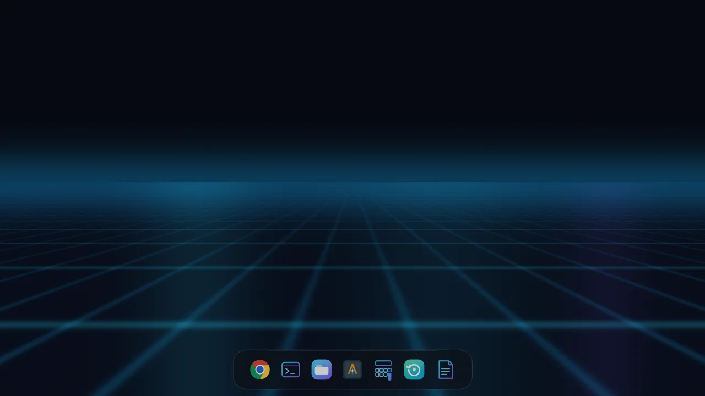
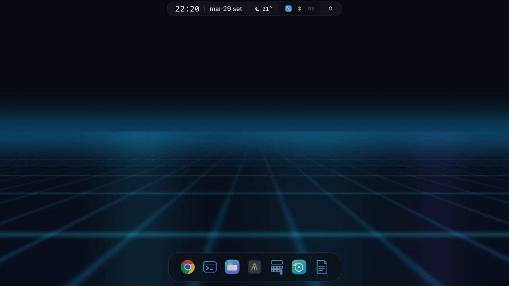
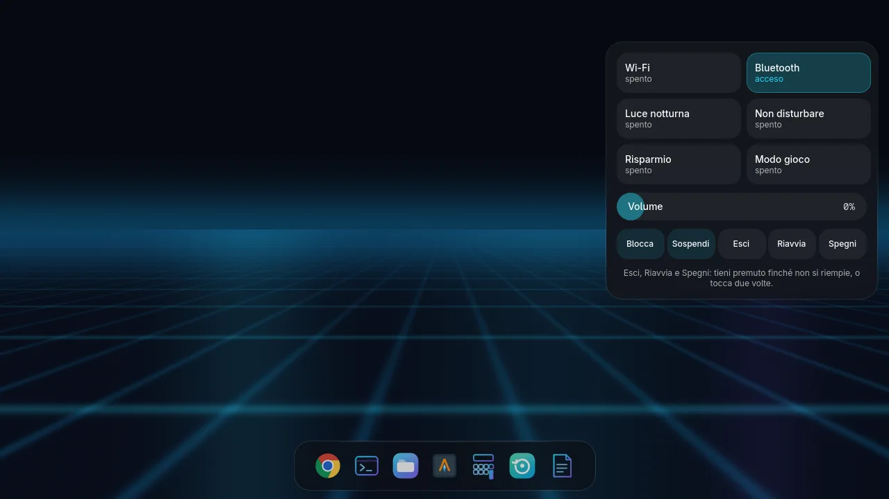
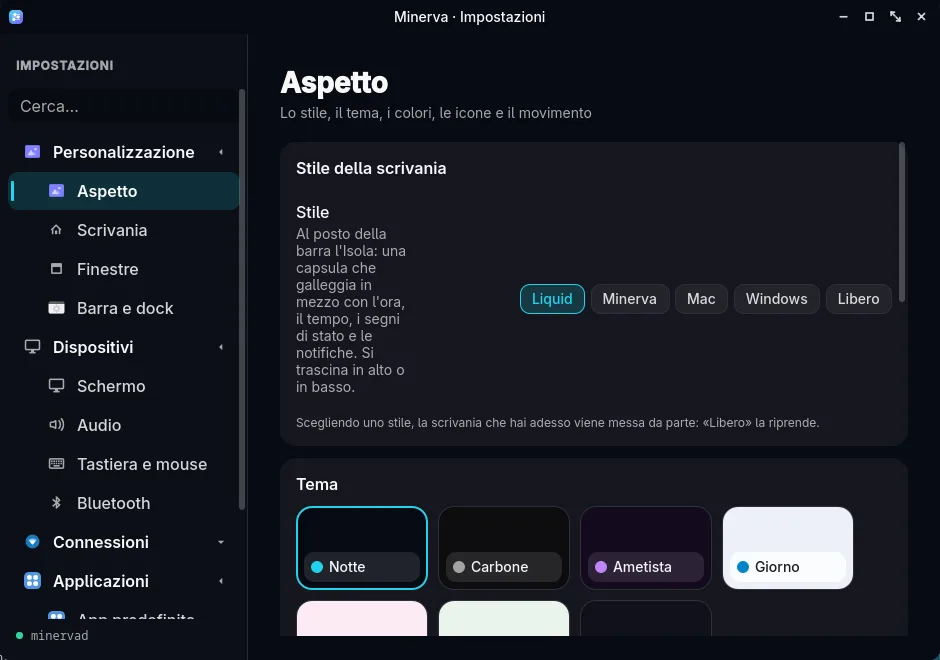

# Liquid DE

Un ambiente desktop per Linux su Wayland, costruito intorno a un'idea: **una
scrivania fluida ed elastica, con testo sempre nitido**. Compositore, shell,
demone, schermata di accesso e applicazioni di sistema fanno parte dello stesso
progetto.

**[Scopri Liquid DE sul sito](https://linuxiano85.github.io/liquid-de-sito/)** ·
[Installazione](#installazione) · [Architettura](#architettura) ·
[Licenza](#licenza)



> Liquid DE è in sviluppo attivo. La versione 1.0 è un obiettivo del progetto,
> non una release già pubblicata. L'installazione guidata è pensata per Arch
> Linux e derivate con `pacman`.

## Il desktop

- **Minerva Wayland** gestisce finestre Wayland e XWayland, più schermi, scala
  frazionaria, cattura dello schermo ed effetti come sfocatura, angoli
  arrotondati e finestre elastiche.
- **L'Isola e la dock** danno accesso a stato del sistema, notifiche,
  applicazioni e controlli senza occupare sempre lo schermo.
- **La shell** comprende scrivania, blocco schermo, impostazioni e applicazioni
  per file, media, testo e attività.
- **L'installer grafico** controlla le dipendenze, mostra l'avanzamento e alla
  fine permette di scegliere il gestore di accesso. Include Minerva Login
  basato su `greetd`.

## Schermate

Le immagini provengono da una **sessione dimostrativa con dati di esempio**.
Sul [sito del progetto](https://linuxiano85.github.io/liquid-de-sito/) trovi
altre schermate e la presentazione delle funzioni.

| L'Isola | Centro di controllo |
|:---:|:---:|
|  |  |



## Installazione

Da una sessione grafica su Arch Linux o una derivata con `pacman`:

```bash
git clone https://github.com/linuxiano85/Liquid-DE.git
cd Liquid-DE
./install.sh
```

L'installer verifica i componenti grafici necessari, mostra le dipendenze
mancanti e chiede i privilegi solo quando servono. Al termine propone i gestori
di accesso disponibili: quello attuale rimane selezionato finché non ne scegli
un altro. Il cambiamento ha effetto al riavvio.

I registri dell'installazione sono in
`~/.local/state/liquid-de/installer/`: i file `launch-*.log` raccontano l'avvio
della finestra; il registro con data e ora segue i comandi dell'installazione.

Per installare dal terminale, senza la guida grafica:

```bash
./compositore/costruisci.sh
./scripts/minerva-compila
./scripts/install-minerva.sh
```

## Architettura

| Componente | Funzione | Tecnologia |
|---|---|---|
| [`compositore/`](compositore/) | Finestre, schermi, input ed effetti | C, fork privato di wlroots 0.20.2 |
| [`minervad/`](minervad/) | Stato del sistema, impostazioni e servizi | Dart |
| [`minerva-shell/`](minerva-shell/) | Scrivania, pannelli, accesso e app | QML su [Quickshell](https://quickshell.org/) |

Shell e demone comunicano attraverso un socket Unix con messaggi JSON. Shell e
compositore usano un canale di testo dedicato. Il fork di wlroots è compilato
nel compositore e non sostituisce la libreria di sistema.

## Stato e prove

Il lavoro verso la 1.0 dà priorità alla stabilità dell'intera sessione e poi
alla fluidità, soprattutto nei giochi. Il percorso previsto comprende prove
automatiche e su hardware Intel e AMD, ottimizzazione del disegno e una resa
SDR coerente. HDR e il renderer Vulkan con tutti gli effetti richiedono ancora
validazione.

Le prove del compositore e parte delle suite della shell e del demone vivono
nel repository separato `Liquid_test`. Questo repository contiene anche prove
e controlli CI per componenti dell'ambiente.

## Licenza

GPL-3.0: vedi [`LICENSE`](LICENSE). La copia di wlroots in
`compositore/subprojects/wlroots` mantiene la licenza MIT originale.
